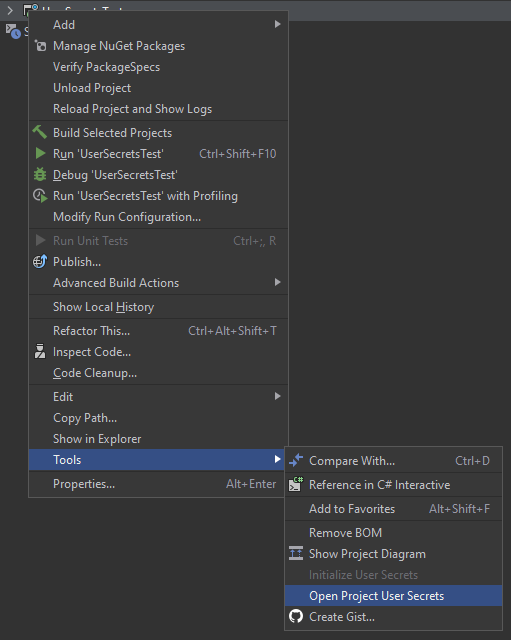

# .NET Core User Secrets
Open the user secrets for a project, for more information see the [User Secrets documentation](https://docs.microsoft.com/en-us/aspnet/core/security/app-secrets).

## How to use

1. Make sure your .csproj file contains the `<UserSecretsId>...</UserSecretsId>` property
2. Right-click on the project in Rider > Tools > Open project user secrets

## Changelog

### 0.2.3
 - Fixed Rider 2020.2 compatibility

### 0.2.2
 - Fixed Rider 2018.3 compatibility

### 0.2.1
 - Fixed user secrets path

### 0.2.0
 - Initial cross platform support
 
### 0.1.0
 - Default file contents

## Local development

Import the project in IntelliJ as a Gradle project.

* To run/debug, use the `Run/debug plugin` run configuration.
* To create a plugin distribution, use the `Build plugin` run configuration. Once completed, the plugin ZIP file will be created in the `build/distributions` folder.
